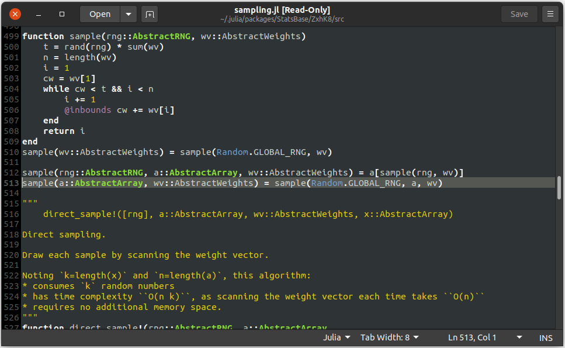

# Where.jl

This package opens the source file of a function for a specific method call through an external text editor, `gedit`. The cursor in the opened file will automatically land at the correct line number inside the editor.

- Works only for a specific (unique) method call of a function/macro (see Example below).
- Does not work for functions/macros that are a part of built-in Julia modules, i.e. `Base` and `Core`.

## Requirements

- Your active terminal should be able to open a display connection.
- You should have file read permissions for the location of package source codes, typically located at `~/.julia/packages`. If you are able to import the packages in `Julia`, you needn't worry about this.

## Installation

```julia
julia> ]
pkg> add https://github.com/sisl/Where.jl.git
```

## Example Usage

```julia
julia> import StatsBase: sample, Weights
julia> a = [1, 3, 5, 7]
julia> w = [2, 4, 6, 8]

julia> sample(a, Weights(w))          # call the function with a specific method.
7

julia> @which sample(a, Weights(w))   # (built-in) output the src location and line number.
sample(a::AbstractArray, wv::StatsBase.AbstractWeights) in StatsBase at ~/.julia/packages/StatsBase/ZxhK8/src/sampling.jl:513

julia> using Where
julia> @where sample(a, Weights(w))   # (this pkg) open the src file at the call line number, using gedit.
```
The last command above spawns a new tab in `gedit` (or opens a new window if there are none) where the cursor automatically lands at the correct line number. Notice that the `sample` function accepts various other methods (such as in Lines 499, 510, 512), but the cursor has landed on Line 513. This is because `sample(a, Weights(w))` only fits the function definition at Line 513.


## Additional Notes

- If you also have write permissions, the opened text editor can also be used to modify the source code. This comes handy when making quick modifications to user defined scripts in a project (located outside of `~/.julia`).

## TODO
- Uses `gedit` by default. Parametrize this, and add support for other OS and editors.
- Open the external text editor to be a background process (such that the Julia terminal isn't blocked out as it is now).
- With some additions, it can be made to work for `Base` and `Core` modules as well.